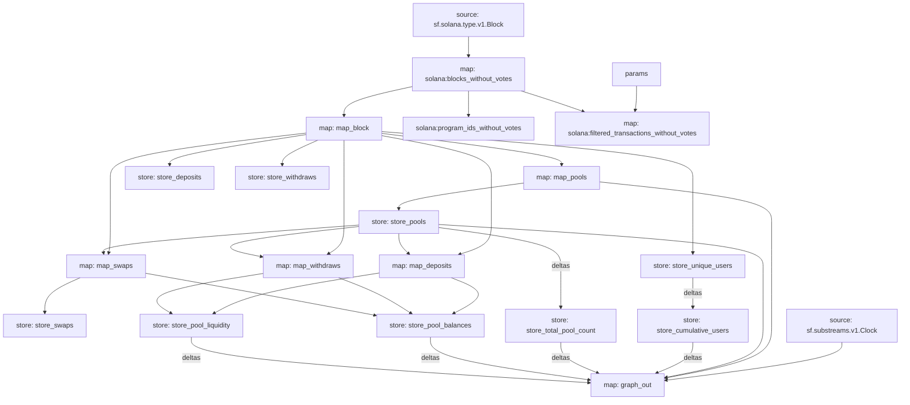

# Orca-Whirlpool Substream

This substream processes Orca Whirlpool transactions on the Solana blockchain, extracting and organizing data related to liquidity pools, swaps, deposits, and withdrawals.

## Overview

The Orca-Whirlpool substream is designed to:

1. Map and process Orca Whirlpool transactions
2. Extract data for pools, deposits, withdrawals, and swaps
3. Store and update cumulative statistics
4. Generate entity changes for downstream consumers (e.g., Graph Protocol) to enable efficient data querying and analysis

## Usage

Refer to the [Repository README](../README.md) for instructions on how to build and run the substream.

## Key Components

### Modules

1. `map_block`: Processes raw Solana blocks to extract Orca Whirlpool events
2. `map_pools`: Extracts and processes pool-related data
3. `map_deposits`: Processes deposit (increase liquidity) events
4. `map_withdraws`: Processes withdrawal (decrease liquidity) events
5. `map_swaps`: Processes swap events
6. `graph_out`: Generates entity changes for the Graph protocol

### Instructions

The substream handles various Orca Whirlpool instructions, including:

- Initialize Pool (V1 and V2)
- Increase Liquidity (V1 and V2)
- Decrease Liquidity (V1 and V2)
- Swap (V1 and V2)
- Two Hop Swap (V1 and V2)

### Data Structures

The main data structures are defined in the `output.proto` file.

### Stores

The substream uses several stores to maintain state:

- `store_pools`: Stores pool data
- `store_deposits`: Stores deposit data
- `store_withdraws`: Stores withdrawal data
- `store_swaps`: Stores swap data
- `store_unique_users`: Tracks unique users
- `store_cumulative_users`: Maintains cumulative user count
- `store_total_pool_count`: Tracks total pool count
- `store_pool_balances`: Stores pool token balances
- `store_pool_liquidity`: Tracks pool liquidity

## Adding Support for New Instructions

To add support for new Orca Whirlpool instructions:

1. Update the `src/pb/orca.whirlpool.v1.rs` file to include the new instruction definition.
2. Modify the `map_block` function in `src/lib.rs` to handle the new instruction type.
3. Create a new mapping function in the appropriate module (e.g., `map_pools.rs`, `map_deposits.rs`, etc.) to process the new instruction data.
4. Update the relevant stores to accommodate any new data fields.
5. Modify the `graph_out` module to include the new data in the entity changes if necessary.

### Graph

